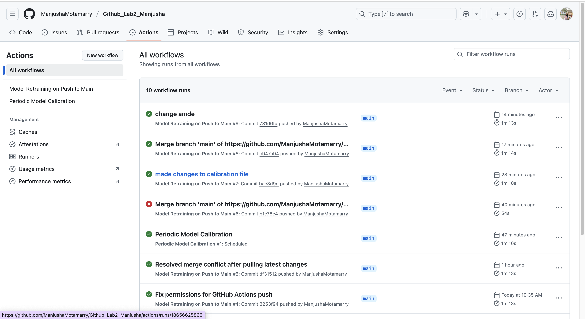

# Gradient Boosting Model Training with GitHub Actions

This repository demonstrates the training and versioning of a **Gradient Boosting Classifier** on the **Digits dataset** using **GitHub Actions**.

## Model Overview

- **Algorithm**: Gradient Boosting Classifier  
- **Dataset**: Digits dataset from `sklearn.datasets`  
- **Evaluation Metrics**:
  - Accuracy
  - F1 Score (weighted)

## Workflow Execution

The GitHub Actions workflow automates:

1. Model training (`train_model.py`)
2. Model evaluation (`evaluate_model.py`)
3. Storing metrics in `metrics/`
4. Versioning the model in `models/`

### GitHub Actions Screenshot

> Screenshot shows the workflow run and successful execution of model training and evaluation.

## Results

After workflow completion, the trained model and metrics are stored in:

- `models/` → trained model with timestamp
- `metrics/` → JSON file containing Accuracy and F1 Score
